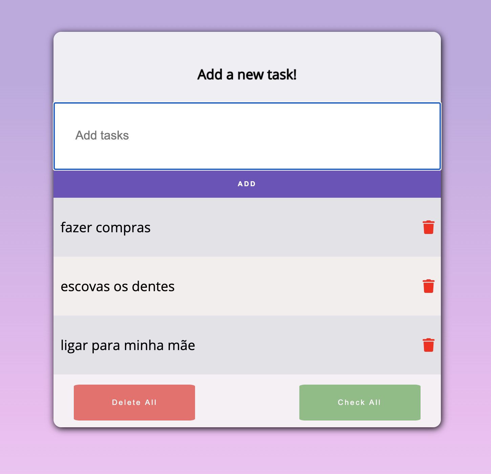

# To do List:




## Etapas do projeto:
1. Faça o clone do projeto e crie uma pasta com o seu nome dentro da lasta `todolist`
2. Pode seguir o layout do exemplo acima ou criar seu próprio
3. Aplicar funcionalidades da todolist usando Javascript + HTML + CSS
4. Subir Pull Request

### Orientaçoes gerais:
- Clonar Repositório https://github.com/reprograma/On5-javascript-II.git
- Criar sua branch `git checkout -b seuNome`, ex: `git checkout -b natalyaPeixoto`
- Adicione uma pasta com seu-nome dentro da pasta exercicio, ex: natalya-peixoto
- Atenção: __Faça alterações apenas nos arquivos dentro da sua pasta__, os arquivos da pasta raiz exercicio não deverão ser modificados para não acarretar conflitos.
- trabalhe dentro da sua branch fazendo todos os commits e pushs direcionados para ela, ao finalizar o projeto realizar o pull request para a master
- A organização final da pasta deverá ficar assim:
```
todolist/
    seu-nome/
        index.html
        style.css
        script.js
    readme.md -> arquivo read me que lemos agora
    imgs -> pasta onde está a imagem que aparece neste readme que lemos agora
```
- data final de entrega __10/07__(sexta-feira)


__Funcionalidades__:
- poder adicionar tarefas
- poder remover tarefas
- poder marcar tarefas como feitas
- ao adicionar tarefa, o campo de input deve ser limpo.
- não pode adicionar tarefa vazia

Nice-to-Have:
- botão para marcar todas as tarefas
- botão para deletar todas as tarefas
